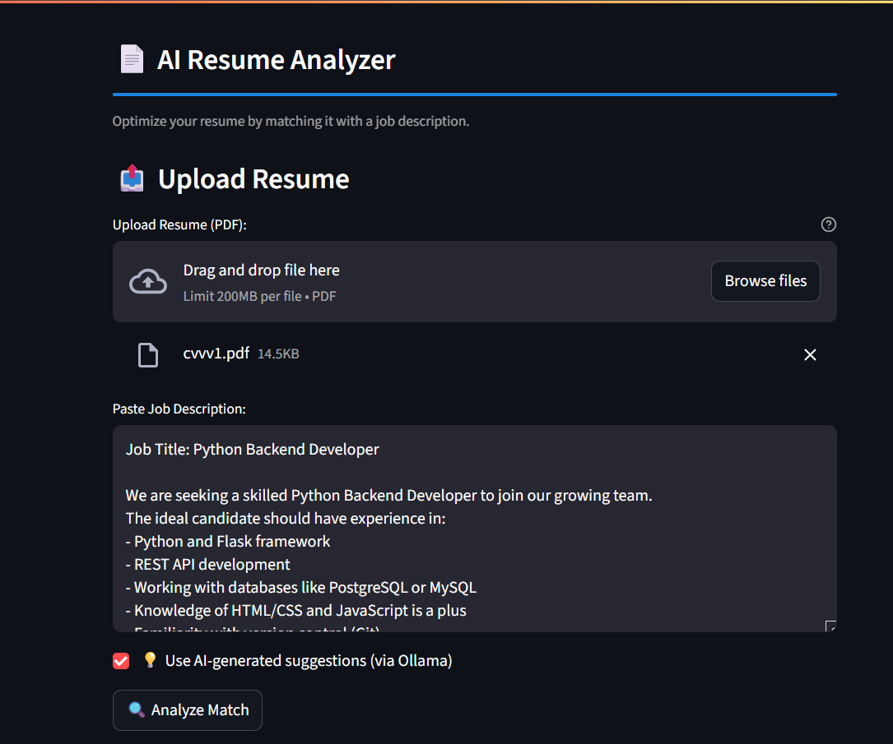
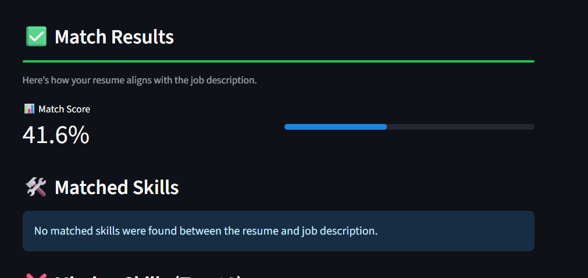
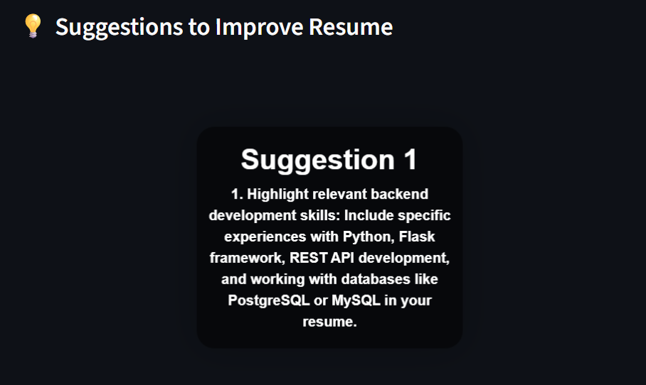
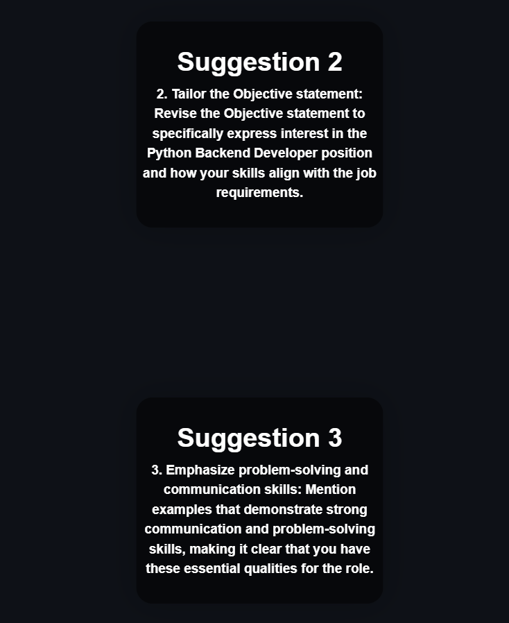

# 📄 AI Resume Analyzer

> Analyze resumes against job descriptions using AI to detect skill gaps, match scores, and personalized improvement suggestions — all locally, no cloud needed.

---

## 📸 Demo







---

## 🚀 Features

- 📄 Upload **your resume (PDF)**
- 🧾 Paste a **job description**
- 🧠 Uses **BERT-based NER** to extract skills
- 🤖 Local **LLM-powered suggestions** with [Ollama](https://ollama.com)
- 📊 Get a **match score** based on semantic similarity
- ✅ See **matched** and ❌ **missing skills**
- 💡 Receive **smart AI suggestions** to improve your resume
- 🔐 100% local — no OpenAI or cloud required

---

## 🛠 Tech Stack

- [Streamlit](https://streamlit.io) – for UI
- [Transformers (Hugging Face)](https://huggingface.co) – for NER and semantic similarity
- [Sentence-Transformers](https://www.sbert.net) – for matching
- [Ollama](https://ollama.com) – for running local LLMs (e.g., Mistral)
- [PyMuPDF](https://pymupdf.readthedocs.io) – for PDF parsing

---

## 📦 Installation

### 1. Clone the repo
```bash
git clone https://github.com/your-username/ai-resume-analyzer.git
cd ai-resume-analyzer
